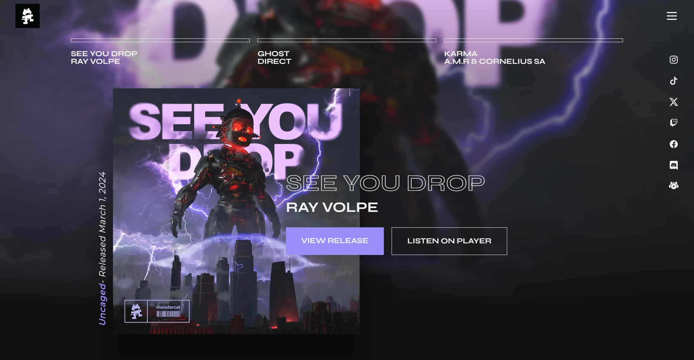

# Clon de la Página Web de Monstercat

Este es un clon de la página web [Monstercat](https://www.monstercat.com/) creado con propósitos educativos y demostrativos.

## Descripción

Este proyecto es un ejercicio de clonación de la página web de Monstercat utilizando HTML, CSS y JavaScript. El objetivo principal es aprender y demostrar habilidades de desarrollo web mediante la replicación de una página web existente.

## Tecnologías

- HTML
- CSS
- JavaScript
- React
- Astro
- Tailwind CSS

## Licencia

Este proyecto está bajo la Licencia MIT. Consulta el archivo [LICENSE](LICENSE) para más detalles.
